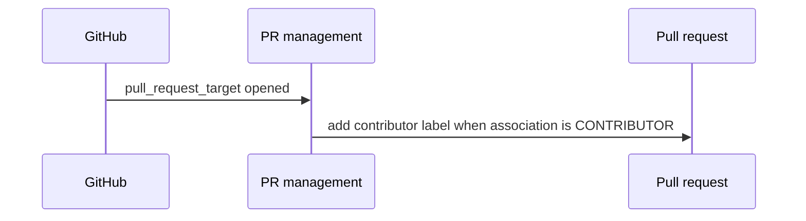

# Product and technical gap baseline

Status: **Proposed**

## Goal and loop

Keep ContextualWisdomLab/OpenCode pull-request automation auditable and fail closed: review the exact PR head, repair the smallest causal defect with a regression contract, obtain exact-head Checks and independent review, then use the ordinary merge path.

## PRD

For pull requests opened in this repository, the local `pr-management` workflow labels authors whose GitHub `author_association` is `CONTRIBUTOR` and performs no model-backed duplicate assessment. If duplicate assessment becomes a product requirement, it must be supplied by the released Contextual Orchestrator contract through `orchestrator/free`; the leaf workflow must not select providers, models, groups, credentials, or paid fallbacks.

Acceptance evidence:

- The parsed workflow exposes only the `add-contributor-label` job.
- The label job retains one SHA-pinned `actions/github-script` step and only `pull-requests: write` and `issues: write` permissions.
- The contract is executable from `script/github/pr-management-contract.test.mjs`.

## TRD and Context Map

| Context                      | Responsibility                                              | Relationship                                      |
| ---------------------------- | ----------------------------------------------------------- | ------------------------------------------------- |
| ContextualWisdomLab/OpenCode | Product source and non-model PR metadata automation         | Owns contributor labeling                         |
| ContextualWisdomLab/.github  | Reusable CI/review/security control plane                   | Supplies versioned reusable workflows when needed |
| contextual-orchestrator      | Provider discovery, capability routing, and model execution | Sole owner of `orchestrator/free` routing         |

The local workflow does not call either control-plane service in this change because duplicate assessment is not a retained OpenCode requirement. Removing the unused job is smaller and safer than preserving a disabled direct-provider implementation.

## UML and ERD

No entity or persistence boundary changes. An ERD is therefore not applicable to this workflow-only delta; inventing storage would create a false domain contract.

## Gap and action status

| Gap                                                                      | Evidence                                                                                                       | Action                                                              | Status                                                  |
| ------------------------------------------------------------------------ | -------------------------------------------------------------------------------------------------------------- | ------------------------------------------------------------------- | ------------------------------------------------------- |
| Disabled direct-provider duplicate job remained in owned workflow source | PR #1 predecessor head contained `OPENCODE_API_KEY`, mutable installer execution, and `script/duplicate-pr.ts` | Remove the entire unneeded job and retain only contributor labeling | Implemented; exact-head hosted evidence pending         |
| No executable contract protected the fork boundary                       | The predecessor had no PR-management contract test                                                             | Parse the workflow and assert its complete allowed job shape        | Implemented locally; exact-head hosted evidence pending |
| Repository-wide inherited scanner findings remain outside this delta     | Previous exact-head Semgrep, Trivy, and CodeQL runs were non-GREEN                                             | Keep the PR Draft/Proposed and repair causal owners without bypass  | Open                                                    |

The authoritative live head, tree, Checks, and review state remain the pull request metadata because embedding a commit SHA in the same commit would be self-referential.
